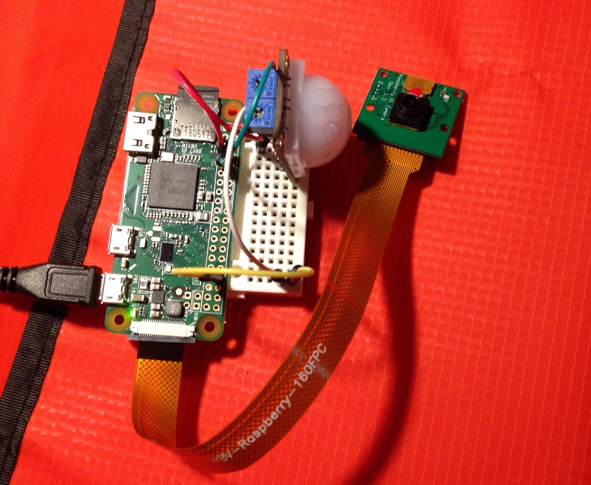
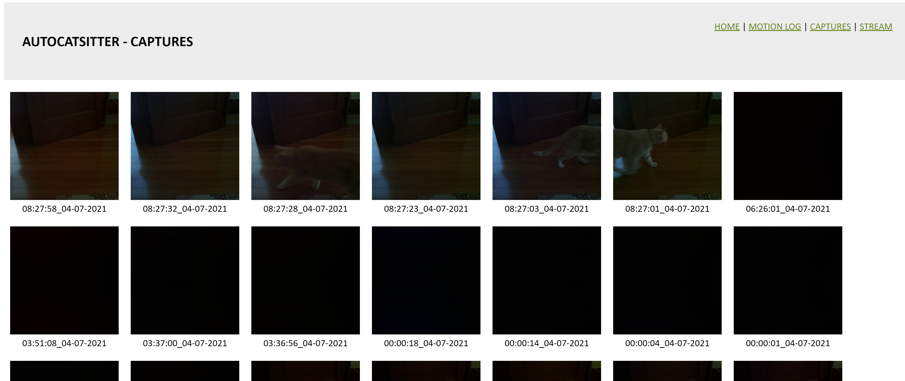
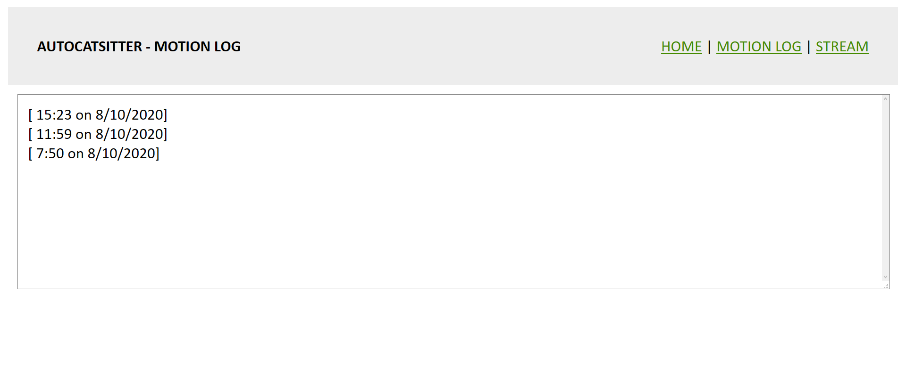

<h1>ACS: AutoCatSitter</h1>
Keep tabs on your cat/other pet while you're away.

Current features
---
- Capture & save picture upon motion detection
- Livestream with web interface

Hardware requirements
---
- Raspberry Pi Zero/3B+
- PIR Motion Detector
- PiCamera  

Images
---

<h4>Basic hardware prototype</h4>

  

<h4>Web interface - Captures</h4>

  

<h4>Web interface - Motion log</h4>

  

