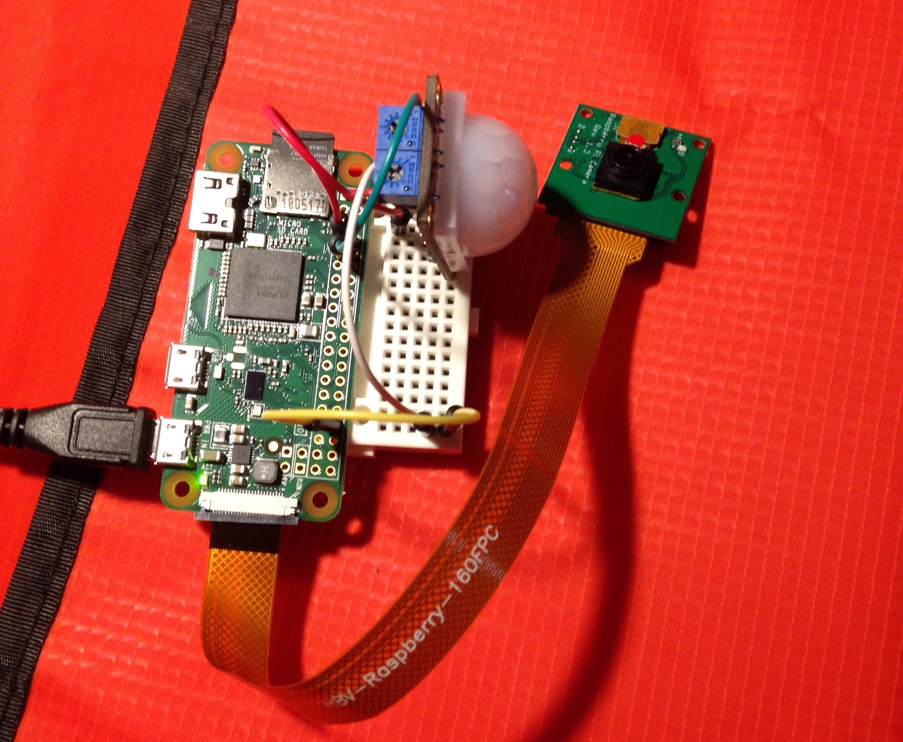

ACS: AutoCatSitter
===================
Watch your cat while you're away. 
This project is a massive WIP at the moment. :P

CURRENT PROTOTYPE: Observer
---------------------------
Captures images when motion is detected. Hardware:
- Raspberry Pi Zero
- PIR Motion Detector
- PiCamera  

Planned additions
----------------- 
1. More streamlined design
	- 3D-printed housing
2. Web interface
	- Python 3: Flask
3. Means of interaction with pet (speakers)
	- No idea how this is going to be implemented as of right now
4. Food-dispensing capabilities
	- Servo motors and all that good stuff
